<picture>
  <source media="(prefers-color-scheme: dark)" srcset="dark.svg">
  <source media="(prefers-color-scheme: light)" srcset="light.svg">
  
</picture>

👋 Hi, I'm Sergey
👀 Interested in coding and building stuff
🌱 Stack: JS, TS, React, RTK, React Query, NextJS, Webpack
💞️ Love programming and sports
🛠 Tech Stack
 JavaScript 

 TypeScript 

 React 

 Webpack 
📊 GitHub Stats

  
  

🔗 Connect with me
https://github.com/Driv3r034
